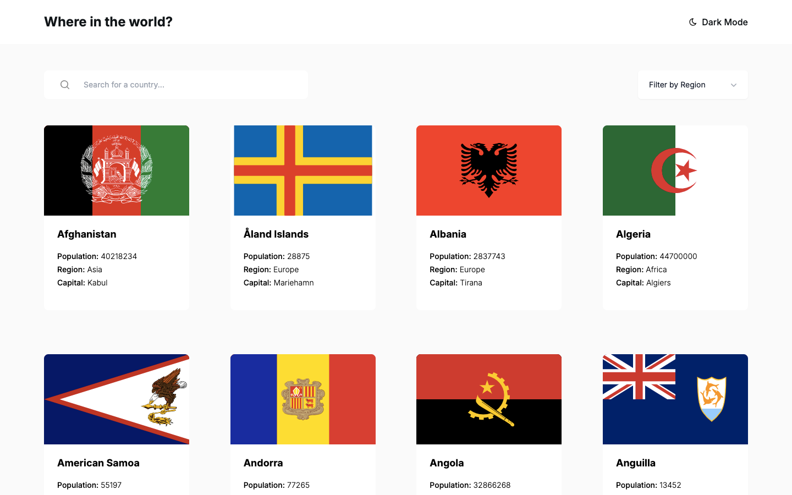

<!-- @format -->

# Frontend Mentor - Solución de API de países REST con selector de tema de color

Esta es una solución al [Desafío de API de países REST con selector de tema de color en Frontend Mentor](https://www.frontendmentor.io/challenges/rest-countries-api-with-color-theme-switcher-5cacc469fec04111f7b848ca). Los desafíos de Frontend Mentor te ayudan a mejorar tus habilidades de codificación mediante la creación de proyectos realistas.

## Índice

- [Descripción general](#descripción-general)
- [El desafío](#el-desafío)
- [Captura de pantalla](#captura-de-pantalla)
- [Enlaces](#enlaces)
- [Mi proceso](#mi-proceso)
- [Creado con](#creada-con)
- [Lo que aprendí](#lo-que-aprendí)
- [Recursos útiles](#recursos-útiles)
- [Autor](#autor)
- [Agradecimientos](#agradecimientos)

## Descripción general

### El desafío

Los usuarios deberían poder:

- Ver todos los países desde la API en la página de inicio
- Buscar un país usando un campo de `entrada`
- Filtrar países por región
- Hacer clic en un país para ver información más detallada en una página aparte
- Haz clic en los países limítrofes en la página de detalles
- Alterna el esquema de colores entre el modo claro y oscuro _(opcional)_

### Captura de pantalla

### Enlaces

- URL de la solución: [https://github.com/Torres2000/rest-countries](https://github.com/Torres2000/rest-countries)
- URL del sitio en vivo: [https://rest-countries-api-wine-pi.vercel.app/](https://rest-countries-api-wine-pi.vercel.app/)

## Mi proceso

### Creado con

- Marcado HTML5 semántico
- Propiedades personalizadas de CSS
- Flexbox
- Cuadrícula CSS
- Flujo de trabajo para dispositivos móviles
- [React](https://reactjs.org/) - Biblioteca JS
- [Next.js](https://nextjs.org/) - Marco de trabajo de React
- [Componentes con estilo](https://styled-components.com/) - Para estilos

### Lo que aprendí

Aprendi a ubicar los detalles de los paices fronterisos al hacer clic en uno de ellos y asi sucesivamente

### Recursos útiles

- [Tailwind CSS](https://tailwindcss.com/): esto me ayudó a estilizar todo mi contenido

## Autor

- Sitio web - [Pedro Torres](https://pedro-j-torres.vercel.app/)
- Mentor de frontend - [@Torres2000](https://www.frontendmentor.io/profile/Torres2000)

## Agradecimientos

Solo un saludo a todos los demás creadores de Frontend Mentor. Es una experiencia de aprendizaje maravillosa ver otras soluciones y ver cómo otros codificadores crean lo mismo.
